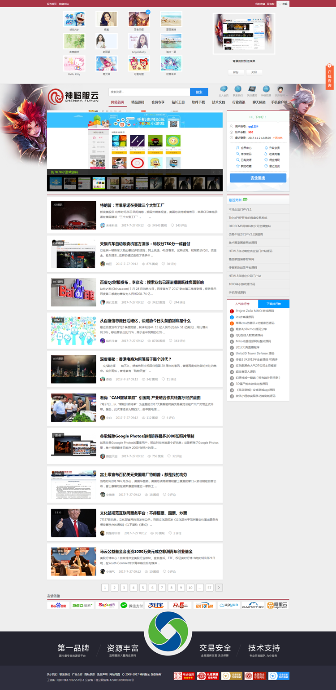
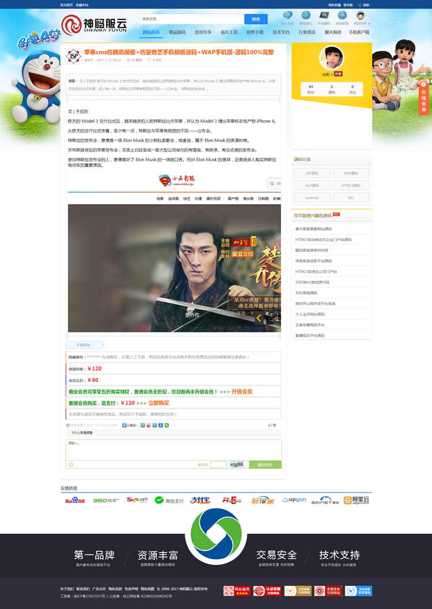

# HTML-神码服云
### 开发语言：html+css+jQuery
### 开发工具：Adobe Dreamweaver CS3，HBuilder
## 网站简述：
一个专注于资源共享的html网站，是我在北大青鸟培训期间参加jQuery特效大赛的作品，拿了名次的。结合了多个网站的优点，使用到了很多技术栈，例如正则表达式、邮箱自动补全、轮播图特效、页面换肤、小火箭喷火返回顶部等，很适合刚入门的web前端小白参考学习。
## 网站截图：
首页(带换肤功能)

源码详情页

